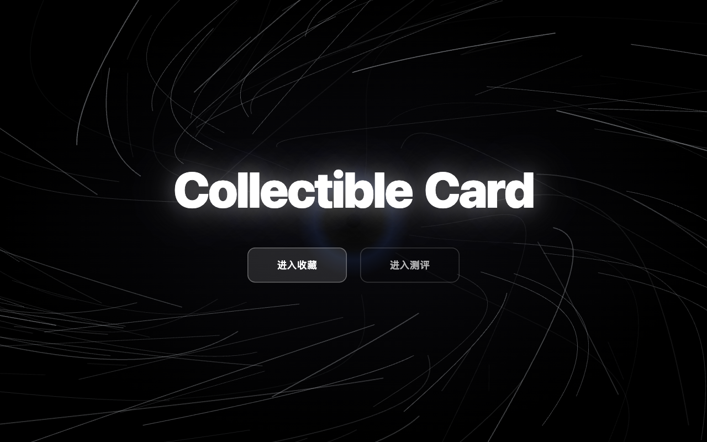
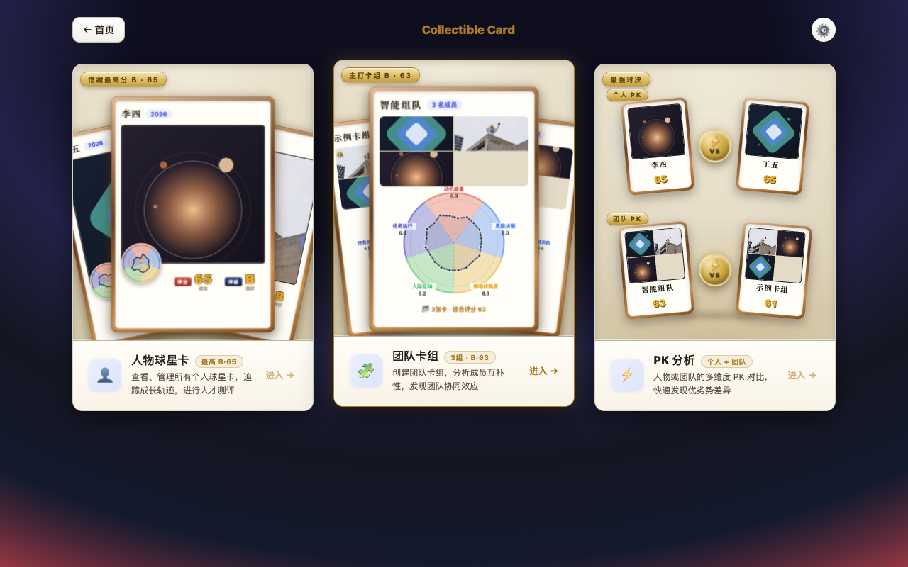
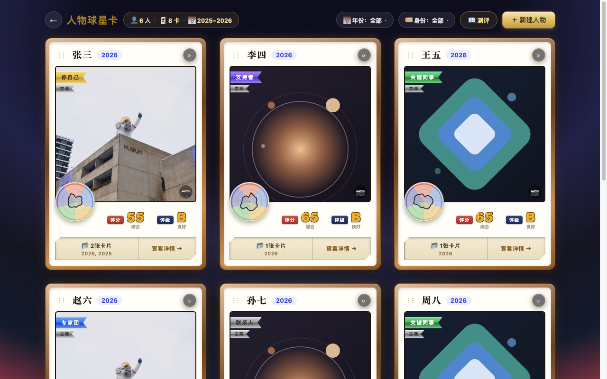
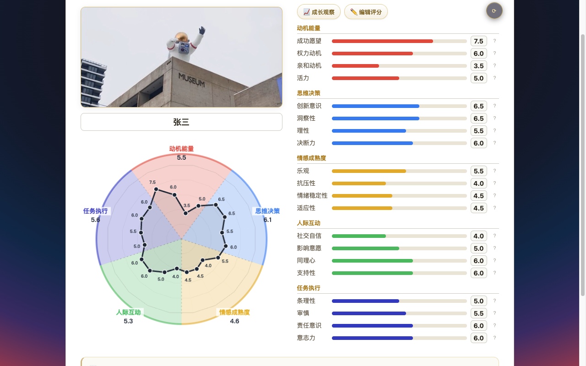
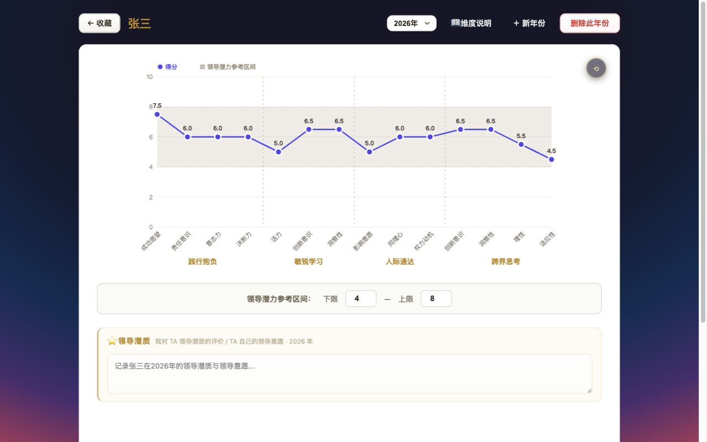
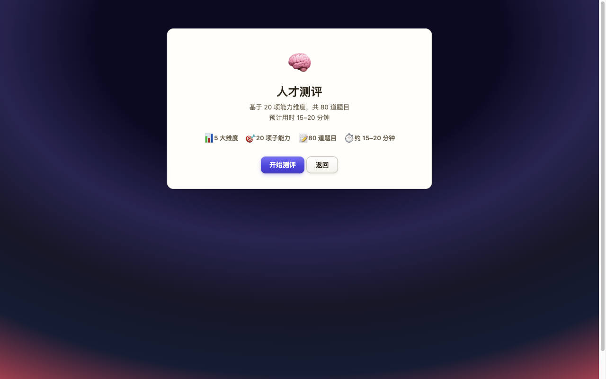
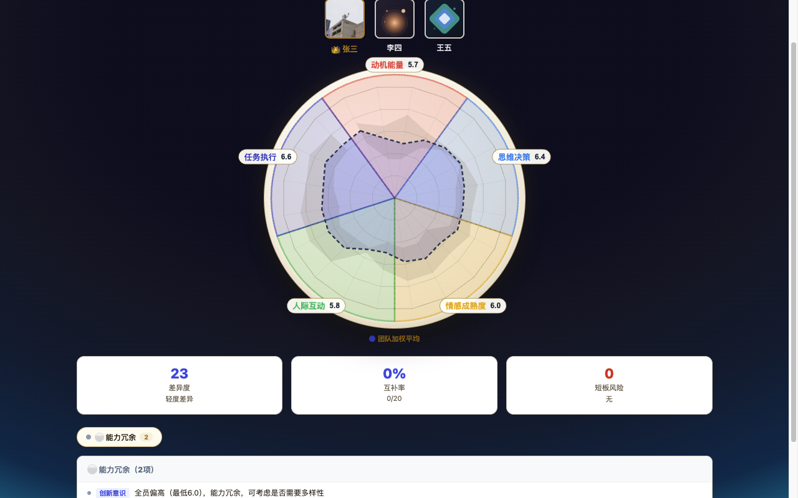
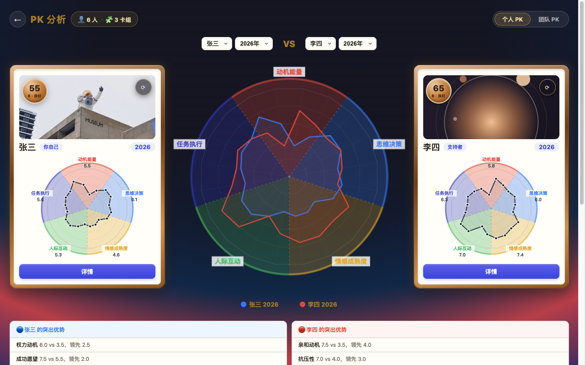
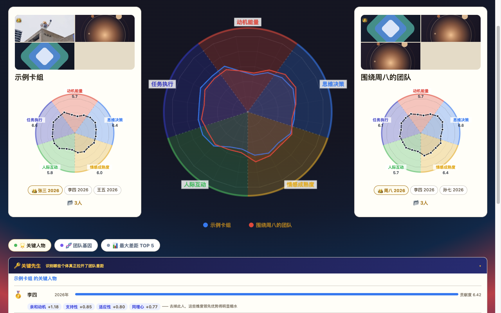
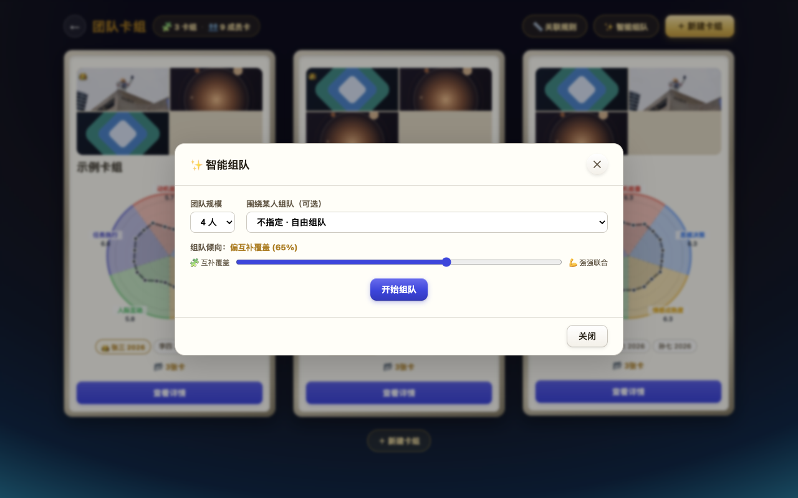

# 球星卡 · Collectible Card


> 把员工的能力数据，做成一张张可以收藏、对比、组队的球星卡。

**球星卡（Collectible Card）** 是一套零依赖、打开即用的人才盘点工具：用 5 大类 20 项子维度给每个人建卡，配上 160 题的自我测评、团队互补性分析、智能组队和一对一的 PK，把「谁强在哪、谁和谁能互补、团队缺什么」变成看得见、能对比、可组合的卡片。

> **灵感来源**
> 这个项目是基于两本书里的部分理念、再加上自己的理解做出来的：
>
> - **瑞·达利欧《原则》** —— 他在桥水给每位员工编制一张「棒球卡」，把能力画像摆在桌面上，配上互相打分与可信度加权的决策方式，让看人、配人、换人都有据可依；
> - **《远见：如何规划职业生涯 3 大阶段》** —— 它把职业生涯看作一场约 45 年的长跑，核心是持续积累三种「职场燃料」：可迁移技能、有意义的经验、持久的关系；其中的「持久关系」——职业生态系统的四种圈层（联系人 / 专家团 / 关键同事 / 支持者），加上「你自己」，正好落地为应用里卡片上的「身份」。
>
> 本项目把这两件事做成了一个可以真的用起来的工具。

**English TL;DR** — Collectible Card is a zero-dependency, single-file web app that turns employee capability data into collectible "star cards": 20 capability sub-dimensions, a 160-question self-assessment, 20-axis radar charts, team synergy analysis, automatic team composition and head-to-head comparison. Everything runs in the browser; data never leaves localStorage.



## 目录

- [为什么做这个](#为什么做这个)
- [功能一览](#功能一览)
- [界面预览](#界面预览)
- [快速开始](#快速开始)
- [使用指南：从一张空卡到一支团队](#使用指南从一张空卡到一支团队)
- [能力模型与计分方式](#能力模型与计分方式)
- [数据存储与隐私](#数据存储与隐私)
- [目录结构](#目录结构)
- [技术栈与实现要点](#技术栈与实现要点)
- [已知限制](#已知限制)
- [路线图](#路线图)
- [贡献](#贡献)
- [致谢](#致谢)
- [许可证](#许可证)

## 为什么做这个

这个项目同时服务两类人：

- **小型公司与团队的负责人**：达利欧在桥水用「棒球卡 + 创意择优 + 可信度加权」做人才管理——听着很美，但中小团队既没有现成的系统，也没有人力去搭一套。这个工具用零依赖、零安装的方式，把「给每人建能力卡、互相打分、按卡组队」压缩成打开就能用的东西。
- **每个在乎自己职业生涯的人**：《远见》说，职业生涯是一场 45 年的长跑，别在中途把燃料耗尽——你得持续积累**可迁移技能、有意义的经验、持久的关系**。这套卡片恰好能把这三样东西落下来：20 项子维度刻画可迁移技能，历年卡片记录你随时间的积累，「身份」则把你的职业生态系统（联系人 / 专家团 / 关键同事 / 支持者）放进卡面。

而无论哪种用法，人才盘点这件事本身通常卡在三个地方：

1. **结论散落在表格和 PPT 里。** 一次盘点的产出往往是几十行 Excel，看过就忘，下次盘点又从头开始。
2. **主观评价缺少可以对话的载体。** 「他沟通不错」「她执行力强」——没有刻度、没有对照组，讨论时各说各话。
3. **团队搭配靠感觉。** 谁和谁能互补、团队有没有共同盲区，很难在没有数据的情况下说清楚。

球星卡把这三件事压缩成一张卡片：卡片是载体，20 项子维度是刻度，卡组和 PK 是对照组。卡片会随年份累积，于是「成长」也留下了痕迹。

## 功能一览

| 模块 | 说明 |
| --- | --- |
| **落地页** | 暗色涡旋粒子动画入口，「进入收藏」或直接「进入测评」 |
| **Hub 卡墙** | 三张入口卡（人物球星卡 / 团队卡组 / PK 分析），实时显示馆藏最高分、主打卡组与迷你雷达预览 |
| **人物球星卡** | 5 大类 20 项子维度评分（0–10，步进 0.1）、综合分与 D/C/B/A/S 评级；卡片正反面；每人可选身份、上传照片（可拖动平移 / 滚轮缩放）；支持逐年建卡与「历年卡片」翻阅 |
| **人才测评** | 内置 160 题自评题库（题目由 AI 依维度反向生成，见下方说明），每次随机抽 80 题（20 项子维度各 4 题），7 点量表；结果一键写回某人某年的卡片，并自动标注数据来源 |
| **团队卡组** | 成员头像马赛克封面、👑 Leader（最多 2 人）与 Leader 权重倍数、每个成员锁定到具体某一年的卡片 |
| **团队分析** | 团队加权雷达 + 差异度 / 互补率 / 短板风险三项 KPI，自动生成互补优势、能力冗余、短板风险、冲突风险洞察，可展开「关联规则」查看判定依据 |
| **智能组队** | 指定团队规模（3–6 人）、可「围绕某人组队」，用一根滑杆在「互补覆盖 ↔ 强弱联合」之间取舍；结果给出 KPI 与理由，可直接保存为卡组 |
| **PK 分析** | 个人 PK 与团队 PK：左右两张卡 + 中间叠加雷达，20 项差异 ≥1.5 视为显著领先；团队模式额外给出战况总结、关键人物、团队基因与差距 TOP |
| **成长观察** | 单人的历年得分趋势视图，配合卡片背面的成长折线与领导潜力参考区间 |
| **数据管理** | JSON 一键导出 / 导入（带版本号与字段级校验）、清空数据、内置示例数据便于上手 |

## 界面预览

| Hub 卡墙 | 人物球星卡收藏 |
| --- | --- |
|  |  |

| 卡片详情 · 正面 | 卡片详情 · 背面（成长折线 + 领导潜质） |
| --- | --- |
|  |  |

| 人才测评 | 团队分析（KPI + 洞察） |
| --- | --- |
|  |  |

| 个人 PK | 团队 PK |
| --- | --- |
|  |  |

| 智能组队 |  |
| --- | --- |
|  |  |

## 快速开始

不需要安装、不需要构建、没有第三方依赖。

**方式一：直接打开（最简单）**

```
双击 src/index.html，用浏览器打开即可。
```

**方式二：起一个本地服务（推荐，避免个别浏览器的本地文件限制）**

```bash
git clone <你的仓库地址>
cd <克隆下来的目录>
python3 -m http.server 8000
# 然后访问 http://localhost:8000/src/index.html
```

浏览器：Chrome / Edge / Safari / Firefox 的现代版本（需要支持 ES6+ 与 Canvas）。

**方式三：部署到 GitHub Pages 在线访问**

把仓库推到 GitHub 后，在仓库 `Settings → Pages` 里把 `Source` 选为 `Deploy from a branch`、分支 `main`、目录 `/(root)`，保存后稍等片刻，即可通过 `https://<你的用户名>.github.io/<仓库名>/` 在线打开——根目录的 `index.html` 会自动跳转到应用，无需额外构建。

**关于演示数据**：首次打开时应用会自动播种 6 位**虚构**人物（张三 / 李四 / 王五 / 赵六 / 孙七 / 周八，共 8 张卡片）与 3 个示例卡组（`示例卡组`、`围绕周八的团队`、`智能组队`），方便直接体验团队分析、智能组队与团队 PK。人物姓名与能力分值均为虚构，与任何真实人物无关；卡面头像用的是项目自带的三张演示头像（一张实拍照片 + 两张程序生成的抽象头像，均为作者自制，放在 `src/assets/avatars/`，替换成同名文件即可换成你自己的；也可以在卡片上点照片区域直接上传，图片只存在你自己的浏览器里）。想从零开始，在「设置 → 清除数据」里清空即可。

## 使用指南：从一张空卡到一支团队

1. **建卡**：收藏页点「＋ 新建人物」，填姓名、选身份（点击卡片上的「＋ 身份」）、上传照片（拖动平移、滚轮缩放）。
2. **打分**——两条路径都行：
   - **主观评估**：卡片上点「✏️ 编辑评分」，20 项逐项给分（0–10）；
   - **自评测评**：点「📖 测评」，80 道题（7 点量表），出分后可直接建新人或写回某人某一年。
3. **翻面看细节**：卡片背面是历年得分折线、领导潜力参考区间与「📝 观察笔记」；点「📂 N 张卡片」可翻阅历年卡片，点「📈 成长观察」看单人趋势。
4. **组队与诊断**：进入「团队卡组」新建卡组，选成员 + 指定每个成员用哪一年的卡，可标 👑 Leader 并调权重；保存后进入分析页看 KPI 与洞察，或点「✨ 智能组队」让程序按你的偏好推荐组合。
5. **PK**：进入「PK 分析」，选两个人（或两个卡组）对决，看叠加雷达与双方显著优势。

## 能力模型与计分方式

**5 大类 20 项子维度**（每项 0–10 分，步进 0.1）

| 大类 | 子维度 |
| --- | --- |
| 动机能量 | 成功愿望 · 权力动机 · 亲和动机 · 活力 |
| 思维决策 | 创新意识 · 洞察性 · 理性 · 决断力 |
| 情感成熟度 | 乐观 · 抗压性 · 情绪稳定性 · 适应性 |
| 人际互动 | 社交自信 · 影响意愿 · 同理心 · 支持性 |
| 任务执行 | 条理性 · 审慎 · 责任意识 · 意志力 |

每个子维度都配有高低分行为锚点描述，可在卡片详情页点「📖 维度说明」查看。

**综合分（0–100）** 采用雷达面积法：把 20 项子维度连成一个 20 边形，与满分 20 边形比较面积后取平方根再乘 100：

```
score = round( sqrt( area / areaFull ) * 100 )
```

**评级**

| 综合分 | ≤30 | ≤50 | ≤70 | ≤85 | >85 |
| --- | --- | --- | --- | --- | --- |
| 等级 | D · 待发展 | C · 发展中 | B · 良好 | A · 优秀 | S · 卓越 |

**测评计分规则**

- 题库 160 题，分布在 20 项子维度上（每项 8 题）；每项子维度第 8 题为**反向题**（共 20 题）。
- 每次测评从每项子维度随机抽 4 题、打乱顺序，共 **80 题**，7 点量表（同意 7 … 不同意 1）。
- 反向题取 `8 - 原始分`；子维度得分 = `((均值 - 1) / 6) × 10`，保留 1 位小数，因此与主观评分同处 0–10 量纲。
- 主观评分与测评结果**分轨保存**，卡片会标注当前展示的是哪一轨，方便对照「自评」与「他评」。

> ⚠️ **关于题库与测评结果的说明**
> 题库中的 160 道题目是由 AI 依据上述 20 项子维度**反向生成**的（先确定要测哪些维度与子能力，再为每项设计陈述句），不是从成熟量表翻译或摘录而来，属于原创内容。但它**没有经过信度、效度检验，不是专业的心理测量工具**：分数只适合作为团队内部对话与自我反思的参考，**不能**用作招聘、晋升、调岗、绩效或裁员等人事决策的依据。请把它当作一张用于讨论的"名片"，而不是一份判决书。

## 数据存储与隐私

所有数据都只存在你自己浏览器的 `localStorage` 里，**没有后端、没有账号、没有埋点**；页面不请求任何外部资源（系统字体栈 + emoji 图标），断网也能正常使用。

| 键名 | 内容 |
| --- | --- |
| `star-card-data-v2` | 人物与卡片 |
| `star-card-groups-v1` | 团队卡组 |
| `pk-insight-width` | PK 页界面偏好 |

导出的备份文件结构：

```json
{
  "version": 2,
  "people": [
    { "id": "...", "name": "李四", "identity": "支持者",
      "photo": null, "photoOffset": 0, "photoScale": 1,
      "cards": [ { "year": 2026, "scores": { "...": {} }, "assessmentScores": null,
                   "refMin": 4, "refMax": 8, "leadershipNote": "" } ] }
  ],
  "cardGroups": [
    { "id": "...", "name": "示范卡组", "leaderWeight": 1.2,
      "leaders": ["..."], "selections": [ { "personId": "...", "year": 2026 } ] }
  ]
}
```

> ⚠️ 数据在本地，意味着**换浏览器、清缓存、换电脑都会丢**。请养成在设置页「导出」备份的习惯；`localStorage` 的键名一旦改动会影响老数据兼容，请勿随意重命名。

## 目录结构

```
collectible-card/
├── index.html               # GitHub Pages 入口页（自动跳转到 src/index.html）
├── .nojekyll                # 让 Pages 跳过 Jekyll 处理、直接当静态站服务
├── src/
│   ├── index.html           # 应用本体：HTML + CSS + JS 单文件
│   ├── question-bank.js     # 160 题题库（20 项子维度 × 8 题）
│   └── assets/avatars/      # 三张演示头像（可替换）
├── docs/
│   └── screenshots/         # 本文档使用的界面截图
├── LICENSE                  # MIT 开源许可证
├── README.md
└── CLAUDE.md                # 面向 AI 编码助手的项目说明
```

> 开发过程中还有一批设计探索稿（`ui-mockups/` 下的四个方向、若干 `*-preview.html` 单点预览页）与原始素材，它们不随本仓库发布。

## 技术栈与实现要点

- **单文件应用**：`src/index.html` 内联 CSS 与 JS，只有题库拆成独立文件；无框架、无构建、无 CDN 依赖。
- **Canvas 2D 绘图**：20 轴雷达图有「详情 / 简版 / 迷你 / 团队」多种渲染模式，卡片背面另有带参考区间的成长折线。
- **SVG + requestAnimationFrame**：落地页涡旋粒子动画；页面切换时径向渐变背景做颜色插值过渡。
- **localStorage + JSON 导入导出**：导出带版本号，导入做字段级校验并兼容旧版扁平数组格式。
- **原生拖拽与鼠标事件**：卡片排序、卡组成员拖入、照片平移缩放。
- **响应式**：780px / 1200px 两个断点。

## 已知限制

- **单机单浏览器**：没有账号体系、云同步与多人协作，数据无法直接在同事之间流转（目前只能导出 JSON 互相导入）。
- **测评不是专业量表**：题目由 AI 反向生成、采用李克特量表自评，没有常模与百分位，信度效度未经验证；跨人比较请谨慎，它适合作为内部对话的起点，不能作为人事决策依据。
- **移动端只做了断点适配**：卡片拖拽与照片平移依赖鼠标事件，触屏体验尚未完善。
- **没有自动化测试**：`tests/` 为空目录，目前依赖手动验证。
- **单文件架构**：便于分发和分享，但不利于长期维护与多人协作。

## 路线图

- [ ] 测评常模与百分位，让分数真正跨人可比
- [ ] 卡片导出为图片 / PDF，方便放进述职材料
- [ ] 多评价者打分与合成（可信度加权的多来源评分）
- [ ] 移动端触屏交互补全
- [ ] 按模块拆分源码，并为计分逻辑补最小回归测试

> 项目仍在持续迭代中（最近更新：2026-08）。

## 贡献

欢迎提 Issue 和 PR。开发流程很简单：

1. 直接编辑 `src/index.html`（或 `src/question-bank.js`），刷新浏览器即可看到效果，没有构建步骤；
2. 提交前请手动走一遍主要链路：新建卡片 → 打分 / 测评 → 卡组 → 团队分析 → PK；
3. 不要随意改动 `localStorage` 的键名与导出文件的 `version` 字段，以免破坏老用户的数据兼容；
4. UI 改动请附截图。

## 致谢

- 瑞·达利欧《原则》（Principles）——「棒球卡」式的人才画像，以及创意择优、可信度加权的决策思路；
- 布赖恩·费瑟斯通豪《远见：如何规划职业生涯 3 大阶段》（The Long View）——「职场燃料」的概念（可迁移技能 / 有意义的经验 / 持久的关系），以及职业生态系统的四种关系（联系人 / 专家团 / 关键同事 / 支持者），落到本应用里就是卡片上的「身份」；
- 演示数据中的人物姓名与能力分值均为虚构，仅用于功能演示；三张演示头像（一张实拍照片、两张程序生成的抽象头像）均为作者自制。

## 许可证

本项目以 [MIT License](LICENSE) 开源：欢迎参考、引用、修改与二次开发，只需保留版权与许可声明即可。
